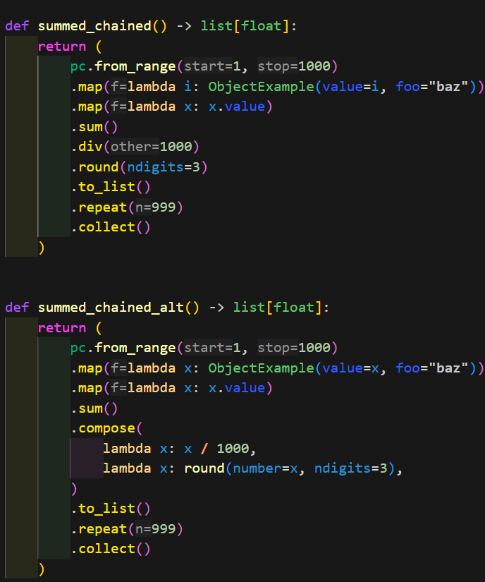
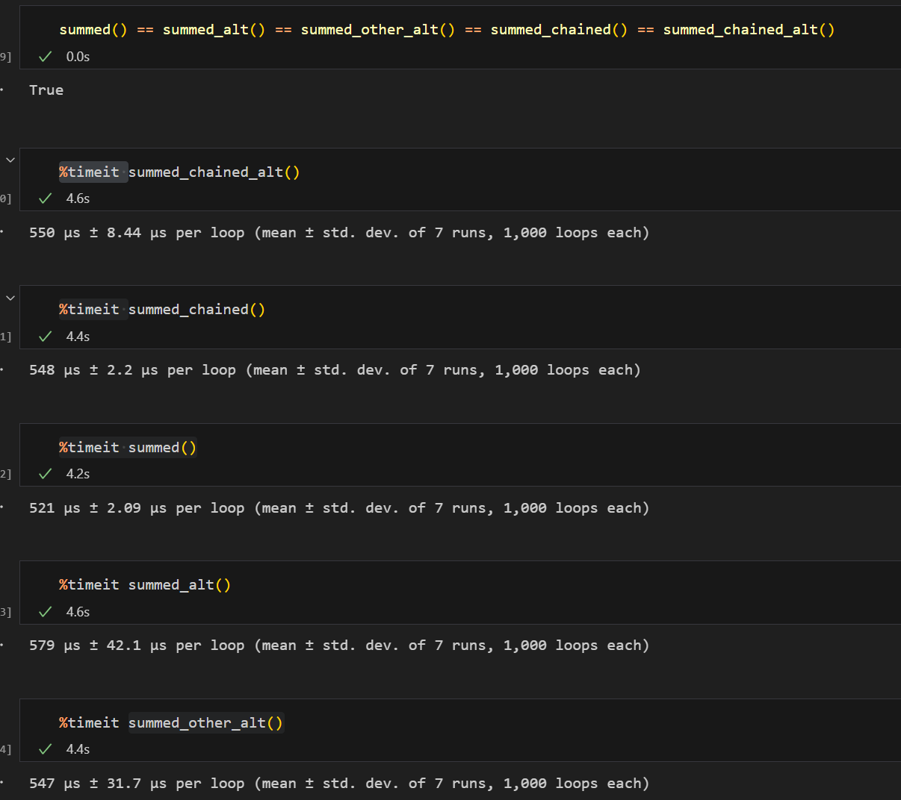

# pychain

pychain is a lightweight project, leveraging cytoolz and toolz, aimed at introducing a more declarative way of using Python.

## Example

Below is presented 3 ways of doing a simple task

### Steps

- Instanciating objects from an iterable, and getting an attribute from them
- Storing thoses in a list
- Doing an aggregation on the value of this list
- Repeating the resulting scalar in a range the same size as the original iterable
- Returning this final list

### Preparation
Importing the project, and declaring a simple class

````python
import pychain as pc
from dataclasses import dataclass
@dataclass(slots=True, frozen=True)
class ObjectExample:
    value: float
    foo: str = "bar"
````

#### Solution 1

As concise as possible.

Almost as unreadable as possible too.

Oddly enough inlining result in the list comp up the computation time from 500 nanosecs to 500 millisecs, for the same result.

````python

def summed() -> list[float]:
    result: float = round(
            number=sum(
                [ObjectExample(value=i, foo="baz").value for i in range(1, 1000)]
            )
            / 1000,
            ndigits=3,
        )
    return [
        result
        for _ in range(1, 1000)
    ]

````

#### Solution 2

Most imperative way. 
Clearer, but longer.

````python
def summed_alt() -> list[float]:
    values_list: list[float] = []
    for i in range(1, 1000):
        values_list.append(ObjectExample(value=i, foo="baz").value)

    total_sum: float = sum(values_list)
    total_average: float = total_sum / 1000
    rounded_average: float = round(number=total_average, ndigits=3)

    final_result: list[float] = []

    for i in range(1, 1000):
        final_result.append(rounded_average)

    return final_result
````

#### Solution 3

A reasonnable middle ground, using modern python syntax.
Replace the for loops by list comprehension, isolate the aggregations.
In this case this is perfectly reasonnable, HOWEVER:
- the code reading order is either from right to left (list comp), or either from left to right (func definition)
- worse, for the aggregation, the order is -> middle(sum of list) -> right (result divided by 1000) -> all the way to the left (round the result from the division)

Keep in mind that my variable declarations are expressive, functions and variables are type hinted, and keywords arguments are declared.
That's often NOT the case.

````python
def summed_other_alt() -> list[float]:
    values_list: list[float] = [
        ObjectExample(value=i, foo="baz").value for i in range(1, 1000)
    ]
    result: float = round(number=sum(values_list) / 1000, ndigits=3)
    return [result for _ in range(1, 1000)]

````

## pychain solution

Linear progression, automatic type inference (even with lambdas)

````python
def summed_chained() -> list[float]:
    return (
        pc.from_range(1, 1000) # initializing the object from an iterable
        .map(lambda i: ObjectExample(value=i, foo="baz").value) # Mapping the instanciation + attribute getting
        .sum() # computation happen here! so far it was only lazy
        .div(1000) # chaining smoothly
        .round(ndigits=3) # the scalar transformation
        .to_list() # returning into a lazy iterator object
        .repeat(999) # repeating the value
        .collect() # computing the result
    )

def summed_chained_alt() -> list[float]:
    return (
        pc.from_range(1, 1000)
        .map(lambda x: ObjectExample(value=x, foo="baz").value)
        .sum()
        .compose( # Alternatively we can use lambdas chaining for iterators as well as scalars
            lambda x: x / 1000,
            lambda x: round(number=x, ndigits=3),
        )
        .to_list()
        .repeat(999)
        .collect()
    )

````

With proper IDE highlighting it's even better!



## Tests

Performance is the same. 

Here the differences are mostly due to noise. The pychain classes are all dataclasses, and they use slots for optimization. 

However they do use frozen True too, which has a performance cost.

In the examples here the time changes are mostly due to noise.

But the visibility gain is way better.

